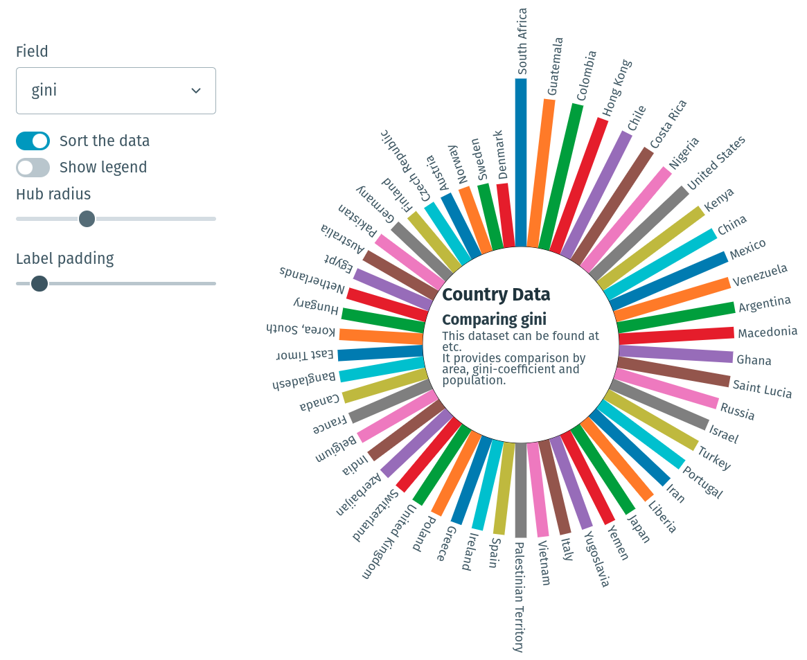

# Circular Bar Chart Component with Svelte

This is a little demo of a circular bar chart, built using Svelte, [Layer Cake](https://layercake.graphics) and a little D3.



[Circular bar chart component](static/circular_bar_chart.m4v)

Layer Cake provides some handy charting utilities and a drawing context that makes it easier to create rich, extensible and composable components.

_Note that you will need to have [Node.js](https://nodejs.org) installed._

## Get started

Install the dependencies...

```bash
npm install
npm run build && npm run preview
```

Your app will be running at [localhost:5000](http://localhost:5000).

## Developing

```sh
# if you didn't already install, run the install command
npm install
npm run dev
```

Your app will be running at [localhost:3000](http://localhost:3000).
